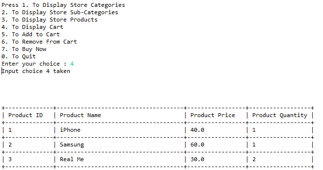

# E-Commerce Application
-----------------------

## Description

Ecommerce, also known as electronic commerce or internet commerce, refers to the buying and selling of goods or services using the internet, and the transfer of money and data to execute these transactions. Ecommerce is often used to refer to the sale of physical products online, but it can also describe any kind of commercial transaction that is facilitated through the internet.

## Project Structure

###### Ecommerce -> pom.xml    
###### &emsp; &emsp; &emsp;&emsp; &nbsp;  -> src/main/java   
###### &emsp; &emsp; &emsp;&emsp;&emsp; &emsp; &emsp;&emsp; &nbsp;       -> com.epam.dao  
###### &emsp; &emsp; &emsp;&emsp; &nbsp; &emsp; &emsp; &emsp;&emsp;&emsp; &emsp; &emsp;&emsp;             -> DbConnect.java  
###### &emsp; &emsp; &emsp;&emsp; &nbsp; &emsp; &emsp; &emsp;&emsp;&emsp; &emsp; &emsp;&emsp;             -> DbConnnectDao.java  
###### &emsp; &emsp; &emsp;&emsp;&emsp; &emsp; &emsp;&emsp; &nbsp;       -> com.epam.model  
###### &emsp; &emsp; &emsp;&emsp; &nbsp; &emsp; &emsp; &emsp;&emsp;&emsp; &emsp; &emsp;&emsp;             -> Category.java  
###### &emsp; &emsp; &emsp;&emsp; &nbsp; &emsp; &emsp; &emsp;&emsp;&emsp; &emsp; &emsp;&emsp;             -> Product.java  
###### &emsp; &emsp; &emsp;&emsp; &nbsp; &emsp; &emsp; &emsp;&emsp;&emsp; &emsp; &emsp;&emsp;             -> SubCategory.java  
###### &emsp; &emsp; &emsp;&emsp;&emsp; &emsp; &emsp;&emsp; &nbsp;       -> com.epam.view  
###### &emsp; &emsp; &emsp;&emsp; &nbsp; &emsp; &emsp; &emsp;&emsp;&emsp; &emsp; &emsp;&emsp;             -> Main.java  
###### &emsp; &emsp; &emsp;&emsp; &nbsp; &emsp; &emsp; &emsp;&emsp;&emsp; &emsp; &emsp;&emsp;             -> Index.java  
###### &emsp; &emsp; &emsp;&emsp; &nbsp; &emsp; &emsp; &emsp;&emsp;&emsp; &emsp; &emsp;&emsp;             -> CategoryView.java  
###### &emsp; &emsp; &emsp;&emsp; &nbsp; &emsp; &emsp; &emsp;&emsp;&emsp; &emsp; &emsp;&emsp;             -> SubCategoryView.java  
###### &emsp; &emsp; &emsp;&emsp; &nbsp; &emsp; &emsp; &emsp;&emsp;&emsp; &emsp; &emsp;&emsp;             -> ProductView.java  
###### &emsp; &emsp; &emsp;&emsp; &nbsp; &emsp; &emsp; &emsp;&emsp;&emsp; &emsp; &emsp;&emsp;             -> CartView.java  
###### &emsp; &emsp; &emsp;&emsp;&emsp; &emsp; &emsp;&emsp; &nbsp;       -> com.epam.service  
###### &emsp; &emsp; &emsp;&emsp; &nbsp; &emsp; &emsp; &emsp;&emsp;&emsp; &emsp; &emsp;&emsp;             -> CartDao.java  
###### &emsp; &emsp; &emsp;&emsp; &nbsp; &emsp; &emsp; &emsp;&emsp;&emsp; &emsp; &emsp;&emsp;             -> CartService.java  
###### &emsp; &emsp; &emsp;&emsp; &nbsp; &emsp; &emsp; &emsp;&emsp;&emsp; &emsp; &emsp;&emsp;             -> CategoryDao.java  
###### &emsp; &emsp; &emsp;&emsp; &nbsp; &emsp; &emsp; &emsp;&emsp;&emsp; &emsp; &emsp;&emsp;             -> CategoryService.java  
###### &emsp; &emsp; &emsp;&emsp; &nbsp; &emsp; &emsp; &emsp;&emsp;&emsp; &emsp; &emsp;&emsp;             -> CheckoutDao.java  
###### &emsp; &emsp; &emsp;&emsp; &nbsp; &emsp; &emsp; &emsp;&emsp;&emsp; &emsp; &emsp;&emsp;             -> CheckoutService.java  
###### &emsp; &emsp; &emsp;&emsp; &nbsp; &emsp; &emsp; &emsp;&emsp;&emsp; &emsp; &emsp;&emsp;             -> ProductDao.java  
###### &emsp; &emsp; &emsp;&emsp; &nbsp; &emsp; &emsp; &emsp;&emsp;&emsp; &emsp; &emsp;&emsp;             -> ProductService.java  
###### &emsp; &emsp; &emsp;&emsp; &nbsp; &emsp; &emsp; &emsp;&emsp;&emsp; &emsp; &emsp;&emsp;             -> SubCategoryDao.java  
###### &emsp; &emsp; &emsp;&emsp; &nbsp; &emsp; &emsp; &emsp;&emsp;&emsp; &emsp; &emsp;&emsp;             -> SubCategoryService.java  
###### &emsp; &emsp; &emsp;&emsp;&emsp; &emsp; &emsp;&emsp; &nbsp;       -> com.epam.exception  
###### &emsp; &emsp; &emsp;&emsp; &nbsp; &emsp; &emsp; &emsp;&emsp;&emsp; &emsp; &emsp;&emsp;             -> ProductDoesNotExistException.java  
###### &emsp; &emsp; &emsp;&emsp; &nbsp;  -> src/main/resources   
###### &emsp; &emsp; &emsp;&emsp;&emsp; &emsp; &emsp;&emsp; &nbsp;       -> log4j2.properties  
###### &emsp; &emsp; &emsp;&emsp;&emsp; &emsp; &emsp;&emsp; &nbsp;       -> Database.properties  

## Some Project Screenshots:

### Welcome Screen

This is the initial screen of our E-Commerce Application.

  

### Product Category

Categories are displayed when you press 1.

  

### Product SubCategory

You can select Category to display Sub Category.

  

### Products

You can see products in a tabular formate.

  

### Add To Cart

You can add products to your cart.

  

### Display Cart

You can view cart.

  

### Wrong Input Exception

Warning for wrong user input.

  

### Remove from Cart Exception

If remove wrong product which is not in your cart then it will warn you.

  

### Display Cart Exeception

You cart is empty.

  

### Buy Now Exception

Without Selection, you cannot buy Anything.

  

### For more information download it now.

Note: These screeshots not cover all features of our application. The functionality may be change in future.

**Created by:**  
**Name: Krishna Kumar Singh**  
**Email: krishnaai265@epam.com**  
**Phone: +91-9368754996** 
